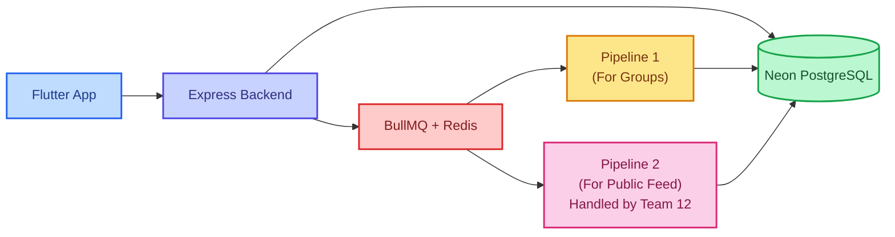

```mermaid
flowchart LR
    App["Flutter App"] --> API["Express Backend"]
    API --> DB[("Neon PostgreSQL")]
    API --> Queue["BullMQ + Redis"]
    Queue --> P1["Pipeline 1<br/>(For Groups)"]
    Queue --> P2["Pipeline 2<br/>(For Public Feed)<br/>Handled by Team 12"]
    P1 --> DB
    P2 --> DB

    classDef client fill:#bfdbfe,stroke:#2563eb,color:#1e3a8a,stroke-width:2px;
    classDef backend fill:#c7d2fe,stroke:#4f46e5,color:#312e81,stroke-width:2px;
    classDef data fill:#bbf7d0,stroke:#16a34a,color:#14532d,stroke-width:2px;
    classDef queue fill:#fecaca,stroke:#dc2626,color:#7f1d1d,stroke-width:2px;
    classDef pipe1 fill:#fde68a,stroke:#d97706,color:#78350f,stroke-width:2px;
    classDef pipe2 fill:#fbcfe8,stroke:#db2777,color:#831843,stroke-width:2px;

    class App client;
    class API backend;
    class DB data;
    class Queue queue;
    class P1 pipe1;
    class P2 pipe2;
```

I've colored each component differently so the layers are easy to tell apart. The NLP Worker box is gone, and the two pipelines now connect directly to the queue and the database.